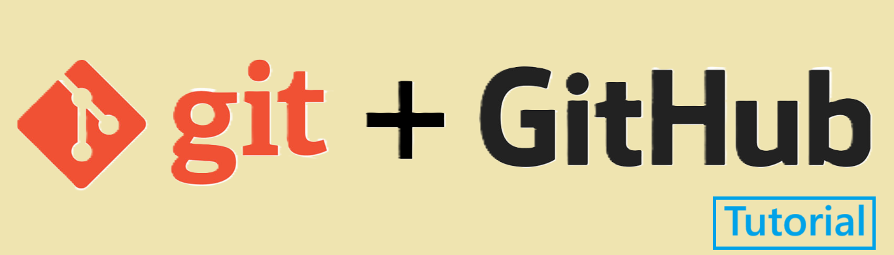
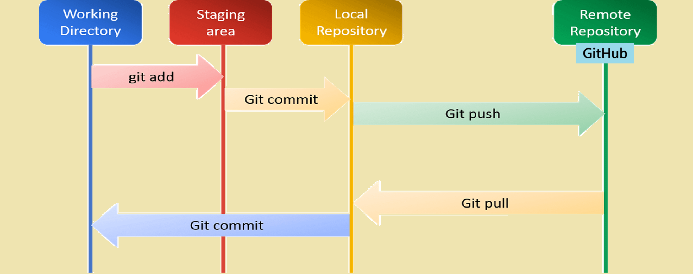

<br/>

# Table of Contents

1. [Introduction](#introduction)
2. [Understanding Git](#understanding-git)
    * [Features](#features)
    * [Installing & Configuring Git](#installing-and-configuring-git)
    * [How Git Works](#how-git-works)
3. [Understanding GitHub](#understanding-github)
    * [Features](#features-1)
    * [Benefits of GitHub](#benefits-of-github)
    * [Working with Remote Directory](#working-with-remote-directory)

<br/>
<br/>
<br/>

# Introduction
Both Git and GitHub have revolutionized how developers work together. 

Git, as a distributed version control system, enables each developer to maintain a complete copy of a repository, while GitHub adds a collaborative layer on top of Git by offering a cloud-hosted service. 

Together, they help teams manage code changes over time and facilitate transparent, coordinated workflows. If you’re moving into a development career or just interested in better version control practices, understanding these tools can equip you with a competitive edge.


### Version Control System (VCS):
It is a tool that records and tracks every change made to a set of files, letting you revisit any previous state. It handles branching, merging, and history so teams can collaborate without overwriting one another’s work.

Git itself is a distributed version control system.


<br/>
<br/>

# Understanding Git
Git was created by Linus Torvalds in 2005 to manage the development of the Linux kernel. 

It’s A free, open-source, distributed version control system (DVCS), which means every contributor has a full copy of the entire codebase and history. 

It helps developers to -
* Track the history of the code (add file, modify file, delete file, etc)
* To collaborate
    * works with other developers in a company (maintain codebase properly so that codes by different developers should not overwrite)

This model contrasts with centralized systems and provides greater resilience, speed, and flexibility for collaboration.


## Features
* **Repository (Repo):** A directory or storage space where your project’s files and revision history are stored.
* **Commit:** A snapshot of your changes. Every commit acts as a checkpoint, enabling you to revert to earlier states if needed.
* **Branch:** A parallel version of your repository. Branching allows you to work on new features or bug fixes independently from the main code.
* **Merge:** The process of integrating changes from one branch into another.
* **Clone:** Making a complete copy of an entire repository to your local machine.
* **Checkout:** Switching between different branches or commits.
Understanding these terms is key to mastering Git’s workflow and leveraging its power effectively.

<br/>

## Installing And Configuring Git

1. **Installation:**

    * For Windows user: Download Git from [git-scm.com](https://git-scm.com) and follow the installer instructions.
    * Open git bash and see git version
    ```bash
    git --version
    ```

2. **Global Configuration:**
```bash
git config --global user.name "Your Name"           # user name setup
git config --global user.email "you@example.com"    # email setup
git config --global core.editor "vim"               
git config --global color.ui auto
```

3. **View Configuration:**
```bash
    git config --list        # See changes of configuration in git
```

<br/>

## How Git Works
Git operates by tracking changes to files over time. When you initialize a Git repository (git init), Git starts recording changes, allowing you to commit snapshots as your work evolves. Git takes snapshots of the file system at each commit. This design ensures you have a robust history that can be revisited or modified when needed.

### 1. Git Initialization:
The first step after configure git you have to initialize git inside your desired directory
```bash
cd myDesiredDirectory
git init
```

The git init command initializes a new Git repository in the current directory. It creates a hidden .git directory, which is where Git stores all the repository's configuration, history, and other metadata related to version control. 

This is the first step in turning an existing project or directory into a **Git repository**. 


---
#### The Git Repository:
A repository (or “repo”) in Git is the central component where your project's files and its entire history are stored. 

Every Git repository contains a hidden .git folder. This folder serves as the database holding every version of your project, including commit histories, logs, branches, and configuration settings. 

Think of a repository as a time machine for your project—it allows you to travel back to any moment in your development history with complete snapshots of your work.

Within a repository, there are three key states for your files:

* **Working Directory:** This is the directory where you actively edit your files. It’s a direct reflection of your project’s current state.

* **Staging Area (Index):** This is a preparatory zone where you place changes that you intend to commit. It allows you to bundle related changes together before permanently recording them.

* **Git Repository (History):** Once you commit, your changes are stored here as part of the project’s history. Each commit represents a snapshot, complete with metadata like timestamps, author information, and a unique hash identifier. This is sometimes called local repository.

Understanding this architecture is essential because it explains how Git manages file changes and enables robust features such as branching, merging, and reverting to past states.

---


### 2. Run git status
```bash
git status
```
The command git status is your first checkpoint for understanding the current state of your repository. When you run this command, Git performs a detailed comparison between:

* **The working directory:** The current files as they exist on your disk.
* **The staging area:** The files that are marked to be part of the next commit.
* **The latest commit in your repository:** The most recently saved state of your project.

The output of git status includes:

* **Untracked Files:** New files that Git isn’t yet managing.
* **Modified Files:** Files that have been changed but not yet staged.
* **Staged Files:** Files that have been added to the staging area via git add and are ready to be committed.


### 3. git add
The git add command is used to move changes from your **working directory** to the **staging area**. This step is crucial because it gives you the control over what your next commit will include, letting you assemble a coherent set of changes rather than an unfiltered snapshot of your working directory.

* **Selective Staging:** It adds individual files. 
```bash
git add <file1> <file2> …
```
* **Bulk Staging:** It adds all modified files.
```bash
git add .
```

### 4. git commit
Once your changes are reviewed and arranged in the staging area, git commit takes center stage.

What it does?
* **Recording a Snapshot:** It takes the files as they exist in the staging area and records them permanently in the repository’s history. This snapshot is stored as a commit.

* **Metadata Inclusion:** Each commit comes with a unique hash (an identifier), a commit message (which describes the changes), timestamp, and author information. This metadata is essential for future reference and collaboration.

* **Version History:** Commits form a chronological record of your project’s development, enabling you to track progress over time, locate the introduction of bugs, or revert to a previous state if needed.

 
```bash
git commit -m "Your commit message"
```

---
### Connecting the Dots: A Typical Cycle
Here’s an overview of how these commands interact within the Git workflow:

* **Working on Your Project:** You modify files in your working directory as you implement new features or fix bugs.

* **Checking Status:** You run git status to see which files are modified, which are untracked, and which changes need attention.

* **Staging Changes:** You use git add to move those selected changes into the staging area, ensuring only the intended updates are prepared for saving.

* **Committing:** Finally, git commit creates a permanent snapshot of these staged changes, recording them in your repository with descriptive metadata.
---

Now You are ready to push all files from your local(git) repository to remote repository like **github** for collaboration and other activities.


<br/>
<br/>
<br/>
<br/>

# Understanding GitHub

GitHub is a cloud-based hosting service for Git repositories that adds a user-friendly interface and various collaboration features. Launched in 2008, GitHub significantly streamlined how developers work together by offering an accessible platform to host code, track issues, manage projects, and review contributions.

<br/>

## Features
### 1. Repository Hosting & Version Control
* GitHub stores all your project files and every change you make to them.
* You can see a history of who changed what (each change has an ID, author, and message).
* You can make branches (copies of your code) to work on new features or fixes without touching the main code.
* When you’re ready, you merge your branch back into the main code—GitHub helps you handle any conflicts smoothly.

### 2. Team Collaboration Tools

* **Pull Requests:** Let you suggest your code changes, discuss them with teammates, and then merge once everyone agrees.

* **Forks:** Make your own copy of someone else’s project so you can experiment; later you can ask them to pull your changes in.

* **Code Reviews & Comments:** Teammates can leave notes right in your code to help improve it.

* **Discussions:** Forum-style threads inside a project for general talk, brainstorming, or planning.

### 3. Issue Tracking & Project Boards

* **Issues:** You can file “to-do” items—bugs, feature ideas, or tasks—and label or assign them to people.

* **Project Boards:** Kanban-style lanes (like “To Do,” “In Progress,” “Done”) to move issues around and see progress at a glance.

* **Milestones & Labels:** Group related issues together (for a release or sprint) and add tags so it’s easy to filter and organize.

### 4. Automation & CI/CD

* **GitHub Actions:** Automate work like running tests, building your app, or deploying it whenever you push code or open a pull request.

* **Packages:** Host and share libraries or tools right alongside your code.

* **Webhooks & API:** Connect GitHub to other services (like Slack notifications or custom scripts) so everything works together automatically.

### 5. Developer Productivity Tools

* **Codespaces:** A full development environment in the cloud—no setup needed on your computer.

* **Copilot:** An AI assistant that writes or suggests code snippets as you type.

* **API & Marketplace:** Build your own integrations or choose from hundreds of apps/actions others have shared to extend GitHub’s features.

### 6. Security & Permissions

* **Protected Branches:** Require reviews or passing tests before code can be merged into key branches.

* **Vulnerability Alerts & Dependabot:** GitHub scans your dependencies for security problems and can even open pull requests to update them.

* **Access Controls:** Give people only the permissions they need (read, write, or admin) so your code stays safe.

<br/>

## Benefits of GitHub
GitHub has grown beyond a tool solely for developers. It has become a community-driven platform where open-source contributions, community learning, and even portfolio building thrive. From startups to multinational enterprises, GitHub is widely used for collaborative, agile development practices that require transparency and rigorous code management.


<br/>
<br/>

## Working with Remote Directory
After committing to local (git) repository you should push your code to remote (github) repository for collaboration.
### 1. Create a repository in github
You should name the remote repository same as your local git repository.
* go to github
* create an account
* create a remote repository (give same name as your local git repository)

**Note:** Make sure remote repository does not contain any file (leave the repository empty) otherwise below steps will not work.


### 2. Add the remote repository to your git
```bash
git remote add origin <remote-repo-url>
git remote -v   # Viewing remote
```


### 3. Push to Remote
```bash
git push origin <branch> 
```
* **Purpose:** Uploads your local commits to a remote repository (like GitHub).

* **Usage:** Updates the remote branch to reflect your latest changes.

**Note:** If the remote has new commits that you don't have locally, Git will reject the push until you integrate those updates.

### 4. Pull from Remote
```bash
git pull origin <branch>  
```
* **Purpose:** Downloads commits from the remote repository and merges them into your current local branch.

* **Usage:** Ensures your local repository is up-to-date with changes made by others.

**Note:** It performs a fetch followed by a merge (or rebase if specified), and may require manual conflict resolution if there are overlapping changes.


