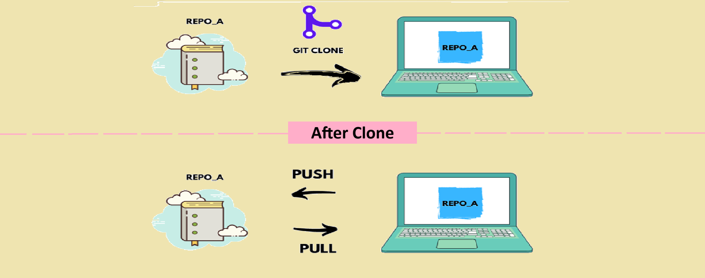

There are two ways to start working with new project in git and github:
1. Create a repository first on remote and then clone it to your local
2. First create a repository in local and then push it to the remote

## 1. Create a repository on remote and clone it
This is the easiest way to start working with a new project.

### Steps:
1. Go to github
2. Sign in
3. Create a new remote repository (e.g., `my-project`).
4. Copy the link of your remote repository
5. Open terminal, go to your desired local folder where you want to clone (you don't need to git initialize this folder) and Clone the remote repository
```bash
git clone https://github.com/<username>/my-project.git
cd my-project
```
Now your github repository in your local machine. 



**Clone** a remote repository means you are creating an exact local copy of a remote repository, including all files, branches, commit history, and metadata.

After cloning a git repository, you can perform push and pull operations.

6. Make any changes and push it to your remote repository.
```bash
git status
git add <file-name>  or  git add .
git commit -m "your commit message"
git push origin <branch-name>
```
7. Go to github repository and refresh the page, you will see the update.
8. Similarly you can make a pull request also to make your local repo update with your remote (github) repo.

```bash
git pull origin <branch-name>
```

### Workflow


<br/>
<br/>

## 2. Create a repository in local and then push it to the remote
This is little bit complex but no problem.

### Steps:
1. Create git repository in your local machine (e.g., `my-project`)
```bash
cd my-project
git init
```
2. Open terminal and run 
```bash
git status
```


3. Add files to staging area from your working directory

```bash
git add <file>   # Stage a specific file
git add .        # Stage all changed files
```

4. Commmit all files from staging area to local git repository
```bash
git commit -m "Your commit message"
```

5. Now go to your github account and create a new repository (give same name as your local git repsitory) e.g., `my-project`

**Note:** Make sure remote repository does not contain any file (leave the repository empty) otherwise below steps will not work.

6. Add the remote repository to your git
```bash
git remote add origin <remote-repo-url>
git remote -v   # Viewing remote
```

7. Push your local files from local git repository to remote github repository
```bash
git branch -M main       # Change the name of branch
git push -u origin main  # First push sets upstream
git push                 # Subsequent pushes
```
**Note:** The -u flag sets the upstream for the branch so future pushes can be done simply with `git push`.

8. Pulling changes
```bash
git pull origin main     # Fetch & merge
```