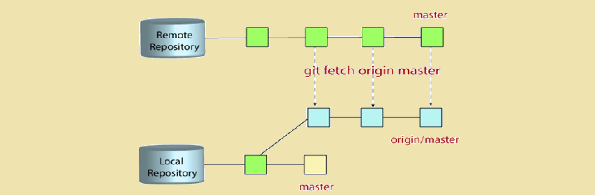

# Getting Started: Clone, Pull, Fetch & Fork
This page explains three essential Git operations:

* **Clone:** Copy a remote repository to your local machine.
* **Pull:** Update your local repository with latest changes from remote.
* **Fetch:** Downloads new data from the remote repository without merging into your current branch.
* **Fork:** Create a personal copy of someone else’s repository on GitHub.

Follow the sections below to learn when and how to use each command.

<br/>
<br/>

# Table of Contents

1. [Clone](#clone)
2. [Pull](#pull)
3. [Fetch](#fetch)
4. [Fork](#fork)
5. [Summary Comparison](#summary-comparison)

<br/>
<br/>

# Clone
Cloning a repository in Git means Creates a **copy of the remote** repository on your local machine that's fully synchronized with the remote repository.

```bash
git clone <repository-url>
```

This enables you to explore the history, make changes, and later push those changes back to the remote repository if needed.


By cloning you're downloading everything from that remote repository, including:

* **The Entire Commit History:** All commits, branches, and tags are copied, so you have full access to the repository's past developments.

* **All Files and Folders:** The working directory is recreated on your local machine with the project's files, allowing you to work offline.

* **The .git Directory:** This hidden folder contains all the metadata, configurations, and version history that Git uses to manage the repository.


<br/>
<br/>
<br/>

# Pull
In Git, the pull command is used to **update** your local repository with changes from a remote repository. It’s essentially a shortcut that does two things:

* Fetches changes from the remote.

* Merges those changes into your current branch.


```bash
git pull origin <branch>
```
Git retrieves any new commits from the remote repository's main branch and attempts to merge them with your local branch.

### Purpose
Pulling ensures that your local copy stays up to date with work done by others, reducing the likelihood of conflicts when you later push your commits.

<br/>
<br/>
<br/>

# Fetch
In Git, the fetch command is used to download commits, branches, and tags from a remote repository into your local repository without modifying your working files.

That's mean, it updates your remote-tracking branches (for example, origin/master) so you can later **inspect the new changes before deciding to integrate them** into your current branch.



### What happens?
It only updates the metadata and **remote-tracking branches**; your **current working branch remains unchanged**.

### When to use?
When you want to review before merging. Since it doesn't merge the fetched updates automatically, you can review differences (using commands like git diff) and decide when and how to integrate these changes (e.g., by manually merging or rebasing).

### Usage Example:
```bash
git fetch origin
```
This command contacts the remote repository named origin and downloads all new data (commits, branch updates, tags, etc.) that have been added since your last fetch.


<br/>
<br/>
<br/>

# Fork
A fork is a **personal copy of another user's repository** that lives on GitHub (or another distributed hosting service). This process creates an independent copy of the repository under your GitHub account.


### How to Fork a Repository

1. Go to the GitHub repository you want to fork.

2. Click the Fork button (top-right corner).

3. GitHub creates a copy of the repo under your account.

4. Clone your fork locally:

```bash
git clone https://github.com/<your-username>/<repo-name>.git
```

### Usage Scenario:

* **Open Source Contributions:** If you want to contribute to a project but don’t have write access to the original repository, you can fork it. This lets you experiment freely—modify code, commit changes, and push them to your own fork.

* **Personal Experimentation:** You might also fork a repository to try out new ideas without risking the integrity of the original project.

### Workflow with Forks: 
After forking a repository, you typically:

* Clone your fork locally using git clone.

* Make changes, commit them, and push back to your fork.

* Finally, submit a pull request to propose merging your updates back into the original repository if you want your changes to be incorporated.

<br/>
<br/>
<br/>


# Summary Comparison

| Feature     | Clone                                    | Pull                                      | Fetch                                                 | Fork                                      |
|-------------|------------------------------------------|-------------------------------------------|-------------------------------------------------------|-------------------------------------------|
| **Purpose** | Create a local copy of a repository      | Update your local repository with remote changes  | Download new commits and metadata without merging     | Make a personal, online copy of a repository in your account |
| **Usage**   | `git clone <repository-url>`             | `git pull origin <branch>`                | `git fetch origin`                                     | Use GitHub’s “Fork” button; then clone your fork           |
| **Scope**   | Local environment                        | Synchronizing and merging remote changes  | Updating only your remote-tracking branches            | Remote repository copy under your own account               |

