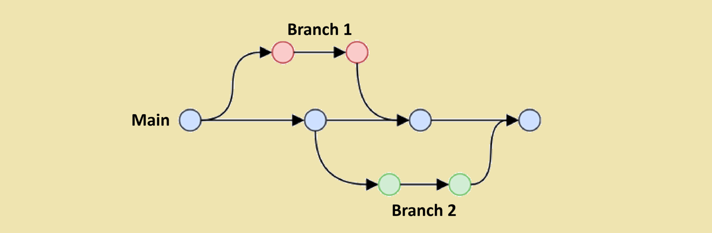

# Branch
In Git and GitHub, a branch is a separate version of a project's codebase, allowing developers to work on different features, bug fixes, or experiments without impacting the main codebase. 

It's essentially a pointer to a specific snapshot of the project's history, enabling isolated development and later merging changes into the main branch. 



<br/>

## Features 
### Isolated Development:
Branches allow developers to work on new features or bug fixes in isolation, preventing conflicts with the main codebase. 
### Pointers to Snapshots:
Each branch points to a specific commit in the project's history, allowing you to revert to a previous state or compare different versions. 
### Independent Lines of Development:
Branches represent independent lines of development, enabling concurrent work on different aspects of a project. 
### Collaboration:
Branches facilitate collaboration by allowing developers to work on separate features and then merge their changes into the main branch. 

<br/>

## Why use branches?
### Experimentation:
Branches provide a safe space to experiment with new ideas or features without fear of breaking the main project. 
### Feature Development:
Developers can create branches for each new feature they are working on, keeping the main branch clean and stable. 
### Bug Fixes:
Bug fixes can be developed in their own branches, ensuring that the fix doesn't introduce new issues into the main codebase. 
### Testing:
Branches can be used for testing new features or bug fixes before they are merged into the main branch. 

<br/>

## How to use branches:
### 1. **Create a branch:** 
Use the git branch command to create a new branch.
```bash
git branch feature-branch
```
This command creates a new branch called `feature-branch`without switching to it.

* **Create and Switch to a New Branch:**
```bash
git checkout -b feature-branch
```
This command both creates the branch and checks it out, so you start working within that branch immediately.

### 2. **List All Local Branches:**
```bash
git branch
```
The branch that you are currently on will be marked with an asterisk (*)

### 3. **Switch to the branch:** 
Use the git checkout command to switch to the new branch

```bash
git checkout feature-branch
```


### 4. **Make changes:** 
Modify the code on the new branch.

### 5. **Commit changes:** 
Save your changes with git commit.

* If you want to **Push a this new Branch to the Remote Repository:**
```bash
git push -u origin feature-branch
```
The -u flag sets the upstream for the branch so future pushes can be done simply with git push.

### 6. **Merge changes:** 
When the work is complete, merge the branch back into the main branch.
* **Check Out the Target Branch:** Ensure you are on the branch that you want to merge changes into (e.g., main): 

```bash
git checkout main
```
* **See differences:** To inspect the differences between your current branch and branch-name before initiating a merge.
```bash
git diff branch-name
```

* **Merge the Feature Branch:** 
Merge the changes from the feature branch (e.g., feature-branch) into main

```bash
git merge feature-branch
```

* **Push the Merged Changes:** Finally, push the updated main to the remote repository:
```bash
git push origin main
```